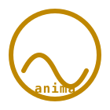

<p align="center">
  
</p>

<h1 align="center">✨ anima-experience</h1>

<p align="center"><strong>Anima Experience</strong> — realtime mutual-information visualizer · HF Space · 60 fps emergence demo · client-side · zero roundtrip</p>

<p align="center">
  <a href="LICENSE"></a>
  <a href="https://huggingface.co/spaces/dancinlab/anima-experience"></a>
  
  
  
</p>

<p align="center">mutual-information · entropy · emergence · canvas · 60fps · client-side · static · no-python</p>

---

`anima-experience` is a 60 fps client-side port of `byte_emergence_demo.py`. Two byte streams flow through a coupled sine-wave engine; mutual information rises as the streams bind. Pure HTML / Canvas / JS — server roundtrip 0, no Python runtime.

> [!NOTE]
> Companion to [`dancinlab/anima`](https://github.com/dancinlab/anima) (consciousness/soul research code, source of `byte_emergence_demo.py`). Dual-remote: pushes to GitHub (`origin`) AND HuggingFace Spaces (`hf`).

## Math

```
emergence = H(L) + H(R) − H(L, R)   (bits)
```

- **Independent random** → emergence ≈ 0 (no binding)
- **Engine-coupled** → emergence > 0 (integrated information)

## Tech

- Static HF Space (`sdk: static`) — first paint < 1 s, no cold start, no Python runtime.
- Vanilla JS — `setInterval` 30 fps tick over a 250-sample rolling buffer.
- Engine: shared `sin(t)` + individual gaussian-ish noise per stream.
  `L = (1−c)·noiseL + c·sin(t)`, `R = (1−c)·noiseR + c·sin(t)`. High coupling
  collapses both streams onto the diagonal — the scatter aligns cleanly.
- 12-bin histogram entropy over `[−1.5, +1.5]`. EMERGENT badge shows only
  when MI > 0.30 (`opacity:0` + `visibility:hidden` otherwise — fully gone).

## Status

- live on HuggingFace Spaces — `https://huggingface.co/spaces/dancinlab/anima-experience`
- static sdk · single `index.html` · zero build step
- 60 fps target on commodity laptop GPU
- dual-remote: `origin` (GitHub) + `hf` (HuggingFace Space)

## Install

No install. It's a static page — clone and open `index.html`, or visit the HF Space.

```sh
git clone https://github.com/dancinlab/anima-experience.git
cd anima-experience
open index.html   # macOS · or `xdg-open` / drag into browser
```

## Run

```sh
# local preview
open index.html

# or serve over HTTP (any static server)
python3 -m http.server 8000
# → http://localhost:8000

# push to BOTH remotes (GitHub + HuggingFace Space)
git push origin main
git push hf main
```

## Repo layout

```
anima-experience/
├── AGENTS.tape       # governance + identity (.tape v1.2)
├── CLAUDE.md         # symlink → AGENTS.tape
├── README.md         # this file (atlas/README-FORMAT.md compliant)
├── TAPE-AUDIT.md     # .tape v1.x adoption audit ledger
├── index.html        # the demo · HTML + inline Canvas + JS
├── docs/
│   └── logo.svg      # repo logo (gold #bf8700)
└── tabs/             # auxiliary tabs / extras
```

## Sister

- [dancinlab/anima](https://github.com/dancinlab/anima) — consciousness/soul cousin (research code, source of `byte_emergence_demo.py`).
- [dancinlab/hexa-brain](https://github.com/dancinlab/hexa-brain) — BCI hardware sister-repo.
- [dancinlab/hexa-senses](https://github.com/dancinlab/hexa-senses) — 5-verb sensory substrate.
- [dancinlab/hexa-mind](https://github.com/dancinlab/hexa-mind) — 7-verb mental substrate.

## License

[MIT](LICENSE) — permissive, do-as-thou-wilt.
